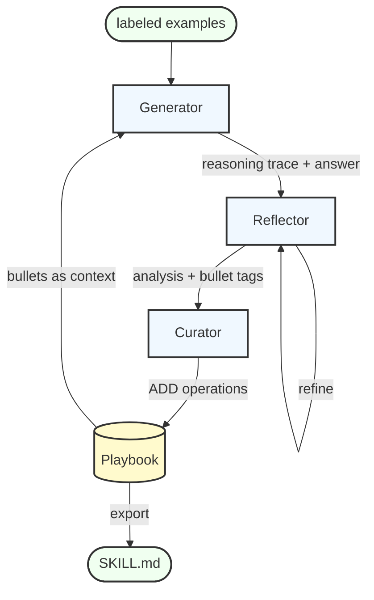

# Agentic Context Engineering (ACE)

A simplified implementation of **Agentic Context Engineering** — a technique where an agent autonomously builds its own reusable knowledge base (a *Playbook*) from labeled training examples, then uses that Playbook to improve performance at inference time.

> Based on the paper [Agentic Context Engineering](https://arxiv.org/html/2510.04618v2).  
> Reference implementation: [ace](https://github.com/ace-agent/ace)

## How it works

Three specialized agents collaborate in a training loop:



At inference time, the Generator retrieves relevant Playbook bullets and uses them as context — without any labeled data.

> **SKILL.md export** is added here on top of the original ACE paper. The trained Playbook is a self-contained knowledge artifact that any coding agent (GitHub Copilot, Claude Code, etc.) can consume as static instructions — no training data, ACE pipeline, or Azure backend required.

## Project structure

```
src/
  models.py        # Pydantic schemas for structured agent outputs
  playbook.py      # Section-based knowledge store with bullet IDs + export
  agents.py        # GeneratorAgent, ReflectorAgent, CuratorAgent
  orchestrator.py  # ACE class: train() loop and run() inference

eval/
  finance.py       # Finance data loader and scoring
  run_finance.py   # Eval harness with --export-skill flag
  data/finance/    # Dataset files (formula)

main.py            # Quick-start example
ref/               # Original reference implementation
```

## Quick start

```bash
# Install dependencies (requires Python 3.13+)
uv sync

# Smoke test (3 train, 3 test)
python -m eval.run_finance --train_size 3 --test_size 3

# Full run + export learned Playbook as SKILL.md
python -m eval.run_finance --train_size 50 --export-skill .github/skills/finance-formula/SKILL.md
```

Requires Azure AI Foundry access and `az login`.

## Training options

`ACE.train()` supports multi-epoch and batched adaptation:

| Parameter | Default | Description |
|---|---|---|
| `epochs` | `1` | How many times the entire dataset is replayed sequentially.  |
| `batch_size` | `1` | How many samples within one pass are processed concurrently (via asyncio.gather) |
| `reflect_iterations` | `1` | Reflector refinement rounds per sample |

## Finance eval task

| Task | Description | Train | Test |
|---|---|---|---|
| `formula` | Arithmetic finance questions, numerical answer | 500 | 200 |

## Sample output

```bash
python -m eval.run_finance --train_size 2 --test_size 1

============================================================
  ACE Finance Evaluation  |  task=formula
============================================================
Loaded 500 samples from formula_train_subset_500.jsonl
Loaded 200 samples from formula_test.jsonl
  Train samples : 2
  Test  samples : 1

─── Training ───────────────────────────────────────────────
  [1/2] ✓  +1 ops
  [2/2] ✓  +2 ops

  Train accuracy : 100.0%  (2/2)
  Playbook ops   : 3

─── Playbook ───────────────────────────────────────────────
## STRATEGIES & INSIGHTS

## FORMULAS & CALCULATIONS
[calc-00002] helpful=0 harmful=0 :: [calc-00002] helpful=0 harmful=0 :: Return on Investment (ROI) = (Net Gain ÷ Total Invested Capital) × 100, where Net Gain = Total Proceeds − Total Invested Capital, and Total Invested Capital includes purchase price plus all additional costs (fees, improvements, taxes, transaction costs).
[calc-00001] helpful=0 harmful=0 :: Current Ratio = Current Assets ÷ Current Liabilities. Use this ratio to assess short-term liquidity by comparing assets expected to be converted to cash within a year against obligations due within the same period.

## COMMON MISTAKES TO AVOID
[err-00003] helpful=0 harmful=0 :: [mistake-00001] helpful=0 harmful=0 :: Calculating ROI using only the purchase price in the denominator while ignoring additional invested costs (e.g., fees, upgrades, closing costs), which overstates returns.

## PROBLEM-SOLVING HEURISTICS

─── Test Evaluation ────────────────────────────────────────
  [1/1] ✗
    Q : For a landscaping business that earned a revenue of $300,000 and an Operating In...
    GT: 15.0   Pred: 0.15

============================================================
  SUMMARY  task=formula
  Train acc : 100.0%
  Test  acc : 0.0%  (0/1)
  Ops added : 3
============================================================
```
